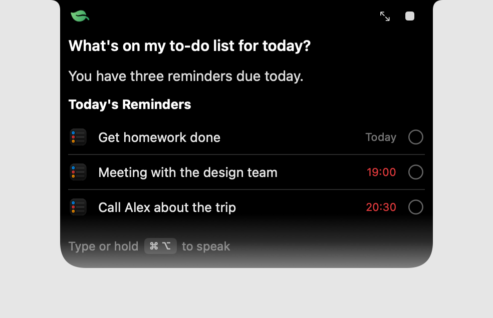
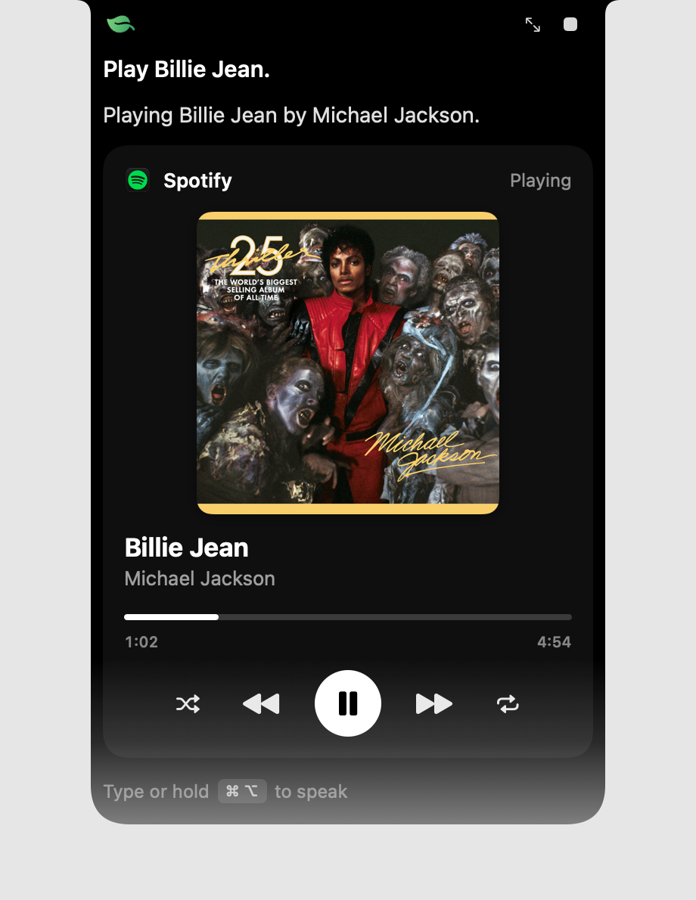
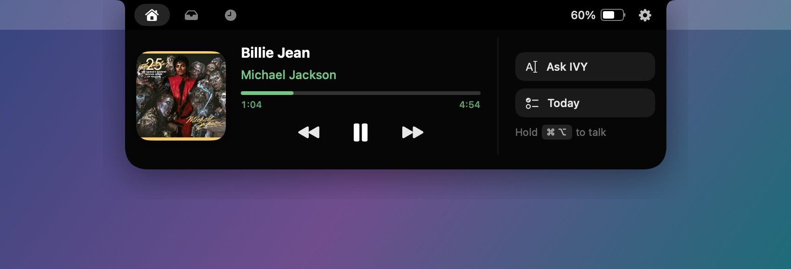
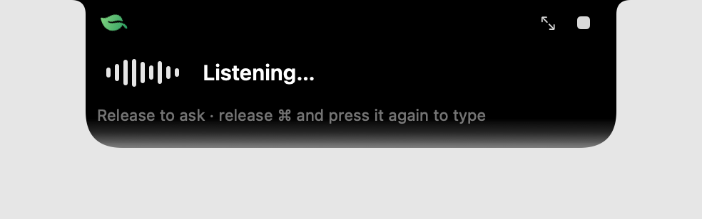
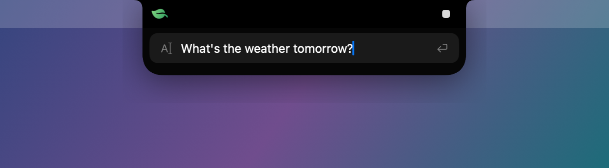
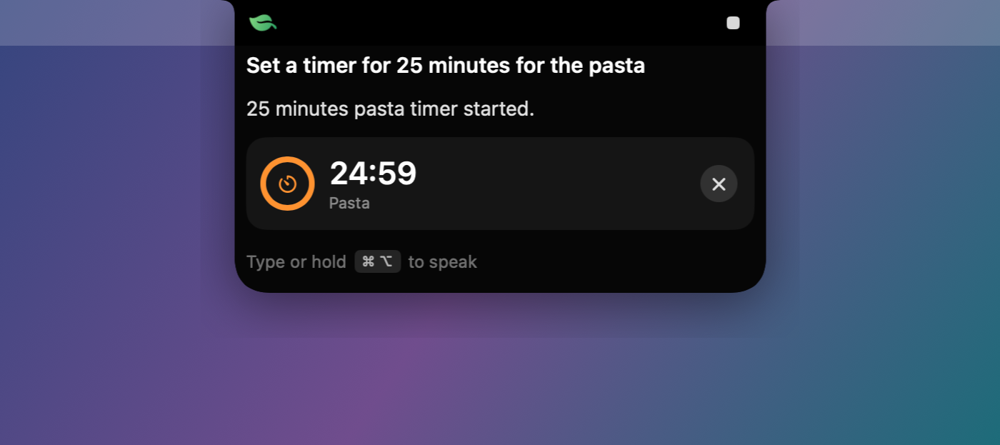
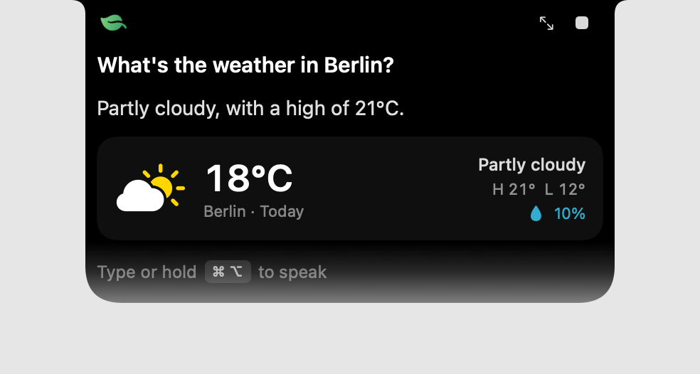
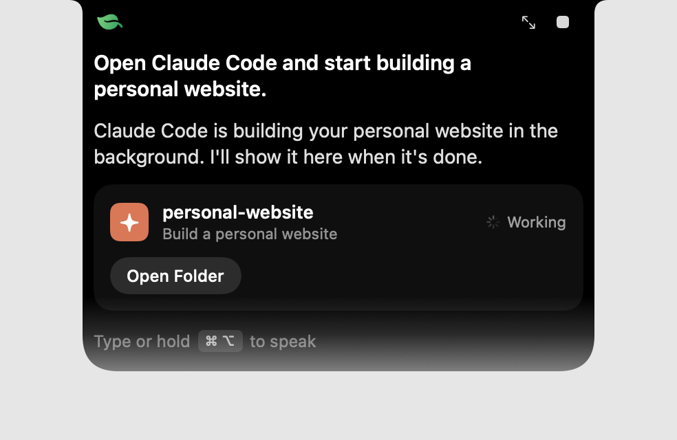
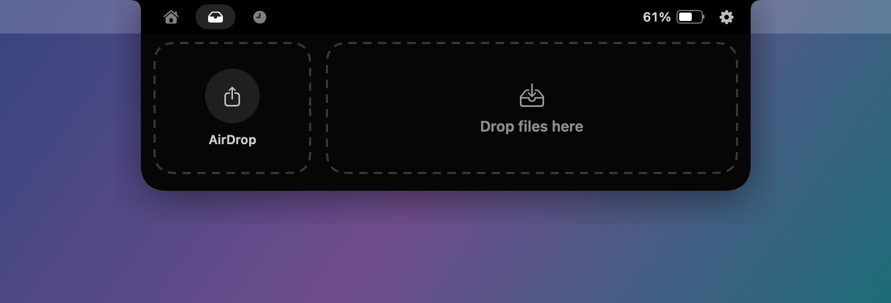

# IVY

**IVY is a private AI assistant that lives in your MacBook's notch.** Hold <kbd>⌘</kbd><kbd>⌥</kbd>, ask a question, and IVY answers from a dark panel that grows out of the notch. Speech recognition and text-to-speech run **locally on Apple Silicon** with [MLX](https://github.com/ml-explore/mlx). The language model runs locally by default, or you can choose **Gemini, Claude or OpenAI** with your own API key in Settings.

- 🎙️ **Voice or text** — hold <kbd>⌘</kbd><kbd>⌥</kbd> for 0.5 s to talk; release <kbd>⌘</kbd> and press it again to type.
- 🧠 **Local LLM** — Qwen3-4B (4-bit) via MLX-LM by default, with native tool calling; 1.7B, 8B and 14B are one click away in Settings.
- ☁️ **Optional cloud AI** — select Gemini, Claude or OpenAI, choose a model and save your own API key in Settings ▸ AI. Keys stay in macOS Keychain.
- 👂 **Local speech-to-text** — MLX Whisper (large-v3-turbo).
- 🗣️ **Local TTS** — Kokoro-82M via MLX (`mlx-audio`). Off by default.
- ✅ **Reminders** — read, create and complete Apple Reminders through EventKit.
- 🎵 **Spotify** — play songs, pause, skip, volume and a now-playing card.
- 🚀 **Apps, files, URLs, browser** — open apps, folders and websites, or run a Google search in Chrome/Safari.
- 🌐 **Web search** — when IVY doesn't know something or it needs current info, it searches in the background and answers from the results (with sources).
- ⏱️ **Timers & alarms** — countdown in the closed notch and an alert when time's up.
- 🌤️ **Weather, calendar, system** — forecast (Open-Meteo), today's events and new events (EventKit), volume/mute, dark mode, battery, disk space, math.
- 🔎 **File search** — “Find PDFs from last week” searches Spotlight; results can go straight onto the shelf.
- 📋 **Clipboard actions** — summarize, bullet points, action items, extract emails/links, CSV ⇄ JSON, tables, fix grammar, change tone, translate — without leaving the notch.
- 📖 **Dictionary** — offline definitions from the macOS dictionary, synonyms and opposites from the selected AI model.
- ✉️ **Mail** — “Any new mail from Alex?” or “Search for invoice in my inbox” (Apple Mail; sender, subject and date only).
- 🏠 **Home & Focus via Shortcuts** — “Lights to 50%”, “Set my focus to sleeping”; IVY creates the Focus shortcuts for you (in your system language), and replies adapt to the active Focus. “Turn on Low Power Mode” works too (macOS asks for your password).
- 🔋 **Energy awareness** — battery health, cycles, temperature and charging advice; models unload sooner when the Mac is hot or low on battery.
- 🔗 **Chained commands** — “Remind me tomorrow at 9 to call Alex, and put it in my calendar too” runs both tools.
- 🎯 **Accuracy helpers** — IVY asks “Which Alex?” instead of guessing, checks that actions really happened, and learns what you meant when you rephrase a request that didn't work.
- 🔔 **Notices** — “Standup in 10 min”, “Battery at 15%” pop out of the notch on their own.
- 👩‍💻 **Claude Code** — open an interactive Claude Code (or Codex) session, or start one on a task.
- 🪄 **Notch dashboard** — hover the notch for a media player with a seekable progress bar, today at a glance (reminders, next event, unread mail, Focus, battery), a drag-and-drop file shelf with AirDrop, and history (inspired by [boring.notch](https://github.com/TheBoredTeam/boring.notch)).
- 🔒 **Private by default** — local AI by default, cloud AI only when selected, no telemetry, no stored audio.

> IVY is an independent open-source project and is not affiliated with Apple, Spotify or Anthropic.

## Screenshots

<p align="center">
  
  
  
</p>

| Closed notch while music plays | Listening | Typing |
| --- | --- | --- |
|  |  |  |

| Timer | Weather | Claude Code |
| --- | --- | --- |
|  |  |  |

| File shelf with AirDrop |
| --- |
|  |

## Requirements

| | |
| --- | --- |
| Mac | Apple Silicon (M1 or later). Tuned for a fanless MacBook Air. |
| macOS | 26 or later |
| Xcode | 26 or later (Swift 6 toolchain) |
| Disk | ~6 GB for the runtime and default models |
| Memory | 8 GB works, 16 GB recommended |

IVY works on displays without a notch too — it attaches to the top center of the screen.

## Install (DMG)

1. Download `IVY-<version>.dmg` from the [Releases](https://github.com/RavoxX/IVY/releases) page, open it and drag **IVY** into **Applications**.
2. Open IVY. If macOS says it can't verify the developer, right-click IVY ▸ **Open** (needed once for builds that aren't notarized).
3. In the setup window click **Install Everything**. IVY downloads its local AI once from the web: the MLX runtime (~1.5 GB) and the models (~4.3 GB). The size is shown before anything starts. After that, local AI runs offline. Alternatively, finish setup and select Gemini, Claude or OpenAI in **Settings ▸ AI** with your own API key (text needs no local models).
4. Hold <kbd>⌘</kbd><kbd>⌥</kbd> and talk.

The DMG itself is small (~3 MB) because models are never bundled into the app.

### Building the DMG

```bash
scripts/build_dmg.sh            # → dist/IVY-<version>.dmg
```

The script builds a Release version (Apple Silicon), signs it with a *Developer ID Application* identity when your keychain has one (otherwise with your Apple Development identity), and creates a drag-to-Applications DMG. For public releases, notarize it:

```bash
xcrun notarytool store-credentials ivy-notary --apple-id <id> --team-id <team> --password <app-specific-password>
IVY_NOTARY_PROFILE=ivy-notary scripts/build_dmg.sh
```

## Build & run

```bash
git clone https://github.com/RavoxX/IVY.git
cd IVY/IVY
open IVY.xcodeproj        # then Product ▸ Run (⌘R)
```

Or from the command line:

```bash
xcodebuild -project IVY/IVY.xcodeproj -scheme IVY -configuration Release build
```

Signing: the project uses automatic signing. Choose your own team under *Signing & Capabilities*. Use a stable identity (e.g. *Apple Development*) so macOS remembers the permissions you grant between builds.

### First launch

IVY opens a compact setup window:

1. Grant **Microphone** access (and optionally **Reminders** and **Input Monitoring**).
2. Detects Spotify and Claude Code.
3. **Install Runtime** creates a private Python environment with MLX packages (~1.5 GB).
4. **Download** the models. Sizes are shown before anything is downloaded:

| Model | Purpose | Size |
| --- | --- | --- |
| `mlx-community/Qwen3-4B-4bit` | Language model | ~2.3 GB |
| `mlx-community/whisper-large-v3-turbo` | Speech-to-text | ~1.6 GB |
| `mlx-community/Kokoro-82M-bf16` | Text-to-speech | ~0.37 GB |

Everything lives in `~/Library/Application Support/IVY/` (`Runtime/`, `Models/LLM`, `Models/Whisper`, `Models/Kokoro`). Nothing is downloaded silently. For cloud AI, you can finish setup without installing the language model or runtime, then choose a provider in **Settings ▸ AI**. Text works without local models; voice input still needs the local runtime and Whisper, and optional spoken answers need Kokoro.

To free disk space, **Settings ▸ AI ▸ Downloaded models** lists every downloaded model with its size on disk. You can delete models one at a time or all at once. IVY unloads a model before deleting it, and you can download it again later.

The runtime installer can also be run manually:

```bash
bash IVY/IVY/Resources/Engine/setup_runtime.sh
```

## Using IVY

| Gesture | What happens |
| --- | --- |
| Hold <kbd>⌘</kbd><kbd>⌥</kbd> 0.5 s | IVY opens and listens. Release to ask. |
| Hold <kbd>⌘</kbd><kbd>⌥</kbd>, release <kbd>⌘</kbd>, press <kbd>⌘</kbd> again | Text field opens. Type and press <kbd>Return</kbd>. |
| Hover the notch | Dashboard: media player, today at a glance, shelf, history, battery, settings. |
| Drag files onto the notch | Opens the shelf; drop to keep them handy or AirDrop them. |
| <kbd>Esc</kbd> / click outside | Closes IVY. |

Try:

- “What's on my to-do list today?”
- “Remind me tomorrow at 5 to call Alex.”
- “Play Billie Jean.” · “Pause the music.” · “Next song.” · “What's playing?”
- “Open Safari.” · “Open Downloads.” · “Open github.com.”
- “Open IVY settings.”
- “Open Claude Code.” · “Open Claude Code and start building a personal website.”
- “Set a timer for 10 minutes.” · “Wake me up at 7.” · “How much time is left?”
- “Open Chrome and search for the Eiffel Tower.” · “Who won the Champions League final?”
- “What's the weather tomorrow?” · “What's on my calendar today?”
- “Turn on dark mode.” · “Mute.” · “How much battery do I have?” · “What's 15% of 80?”
- “Find the budget spreadsheet from yesterday.” · “Where is my tax return PDF?”
- “Summarize my clipboard.” · “Turn the clipboard into JSON.” · “Translate what I copied to German.”
- “Define serendipity.” · “Synonyms for happy.” · “What's the opposite of generous?”
- “Any new mail from Alex?” · “Search for invoice in my inbox.”
- “Lights to 50%.” · “Turn on Work focus.” · “What focus is on?”
- “How's my battery health?” · “Should I charge?” · “Is my Mac overheating?”
- “Remind me tomorrow at 9 to call Alex, and set it up in Calendar too.”

The shortcut, hold time and text-mode window are configurable in **Settings ▸ Shortcuts**.

## Architecture

```
IVY/
├── IVY.xcodeproj
├── Config/                     Info.plist (usage strings), entitlements
├── IVY/                        macOS app target (SwiftUI + AppKit)
│   ├── App/                    Entry point, AppDelegate, composition root
│   ├── Core/
│   │   ├── Engine/             EngineProcess (JSON-lines bridge), RuntimeManager
│   │   ├── LLM/                MLXLLMService, LLMTextService
│   │   ├── Speech/             AudioCaptureService, LocalWhisperService
│   │   ├── TTS/                KokoroMLXTTSService, chunked playback
│   │   └── Input/              GlobalShortcutManager (event tap / polling)
│   ├── Services/               Spotify, Reminders, Claude Code, apps, permissions…
│   ├── Tools/                  IVYTool implementations exposed to the model
│   ├── UI/                     Notch panel, dashboard, cards, settings, setup
│   └── Resources/Engine/       ivy_engine.py, setup_runtime.sh
└── IVYKit/                     Swift package: platform-independent core + tests
    └── Sources/IVYCore/
        ├── Input/              ModifierGestureStateMachine
        ├── Agent/              AgentService, CommandRouter, ToolCallParser, cloud providers
        ├── Tools/              IVYTool protocol, registry, risk policy, allowlist
        ├── Services/           HistoryStore, SettingsStore, reminder transforms
        └── Utilities/          Logging, date parsing, notch geometry
```

### Request flow

```
⌘⌥ gesture ─▶ microphone ─▶ MLX Whisper ─▶ transcript
                                              │
typed text ───────────────────────────────────┤
                                              ▼
                         CommandRouter (instant, deterministic)
                           │ match                 │ no match
                           ▼                       ▼
                         tool ◀──── tool call ──── selected AI model
                           │                       ▲
                           └── result ─────────────┘ (short answer)
                           ▼
                  cards in the notch  ─▶  optional Kokoro speech
```

- **CommandRouter** handles unambiguous commands (“pause”, “open Safari”, “open IVY settings”, “remind me…”, timers, math) without the model: instant, and works while the model loads.
- An **action-claim guard** stops the model from saying it did something (“I opened Chrome…”) without calling a tool. It re-prompts once, then answers honestly that it can't.
- **Learned phrases** come first: when a request fails (or gets a text-only answer) and you rephrase it within a minute, the tool call that worked is remembered for your original words and runs directly next time. Nothing time-dependent or high-risk is learned; the list is in Settings ▸ Advanced.
- Everything else goes to the **selected AI model**: local Qwen3 uses its native `<tool_call>` format; cloud providers use native API function calls with the same argument validation, confirmation policy and action-claim guard. The request line carries a short **“likely tools” hint** from keywords (mail → `mail_search`), which steers small models without changing the cached tool list. Tool results go back to the model for a one-sentence answer, or are shown directly when the tool's summary already is the answer.
- **Ambiguity is a question, not a guess**: when several people, reminders or shortcuts match (“Alex” → Alex Kim / Alex Meyer), the tool asks which one, the notch stays open with the text field ready, and your reply continues the conversation.
- **Actions are verified**: calendar events and reminders are read back after saving, volume/mute and dark mode are re-read, Focus is checked after the shortcut runs (with Full Disk Access), Spotify verifies the song that actually started, and Low Power Mode is re-checked.
- An optional **writing model** (Settings ▸ AI) writes web answers, clipboard rewrites and dictionary lists, e.g. Qwen3 14B, while the main local model stays small and fast for commands. With cloud AI, the selected cloud model handles both commands and writing. Local clipboard rewrites stream into their card; cloud rewrites appear when the provider response completes.
- The model never gets a shell. Tools take **validated, structured arguments**.

### The notch animation

The window has a fixed size and never resizes. The notch silhouette is a Core Animation `CAShapeLayer` mask whose path springs (`CASpringAnimation`) from the camera housing to the panel. SwiftUI content is laid out at its final size and revealed by the mask, so the panel grows out of the notch without text re-flowing. Clicks pass through everywhere outside the visible shape.

### The local engine

MLX's most mature LLM, Whisper and Kokoro implementations are Python packages, so IVY bundles a small sidecar (`ivy_engine.py`) and keeps it behind clean Swift protocols (`LocalLLMService`, `SpeechRecognitionService`, `TTSService`). The native implementations can be swapped later without touching the UI.

- One process per role (`llm`, `stt`, `tts`), started lazily and talking **JSON Lines over stdin/stdout**. There's no server and no port, and the user never starts anything manually.
- Engines unload after inactivity (Settings ▸ AI), which frees all model memory.
- The LLM role keeps a **prompt-prefix KV cache**: the system prompt and tool schemas are prefilled once, so follow-up requests reach the first token in ~0.15 s on an M5. IVY **warms this cache as soon as you start talking or typing**, so even the first request after the model loads doesn't wait for the ~5k-token tool list.
- Runs with `HF_HUB_OFFLINE=1`: models load only from local folders.

### Changing the model

With **Local (MLX)** selected, Settings ▸ AI lets you pick Qwen3 1.7B / 4B / 8B / 14B (14B writes best but is about half as fast as 8B; use it with 24 GB+ memory) or point **Model path** at any MLX-format chat model folder. Tool calling works best with models whose chat template supports `tools` (Qwen2.5/Qwen3 family).

### Cloud AI

In **Settings ▸ AI**, choose **Google Gemini**, **Anthropic Claude** or **OpenAI**, select a model preset (or enter a custom text model ID with function calling), enter your own API key and click **Save API Key**. Each provider keeps its own model preference and Keychain entry. You can replace or remove a key there. Settings reset restores Local as the provider; saved keys remain in Keychain until you remove them.

The selected provider handles chat, tool planning, web answers, clipboard rewrites and dictionary generation. The optional local writing model applies only to Local (MLX). Cloud AI needs internet access and API access/billing for the chosen model. Invalid credentials, unavailable models, quota errors and incomplete responses are reported; IVY never silently switches providers or falls back to another model. Cloud replies appear when each API response completes; the output budget includes reasoning and tool arguments.

Your request, recent conversation context, tool schemas and tool results are sent directly over HTTPS to the selected provider. Depending on what you ask, this can include clipboard text, mail metadata, reminders, calendar events and file-search results. Microphone audio and TTS remain local. Selecting a provider, saving a key or opening the notch sends no background test/warm-up requests; instant commands that need no model still run locally. Switch back to **Local (MLX)** to keep model processing on your Mac.

The adapters use the [OpenAI Responses API](https://developers.openai.com/api/docs/guides/function-calling), [Anthropic Messages API](https://platform.claude.com/docs/en/api/messages/create) and [Gemini generateContent API](https://ai.google.dev/gemini-api/docs/function-calling). OpenAI requests set `store: false`; provider data policies still apply to cloud requests. Keys are never stored in UserDefaults, history or logs.

## Integrations

**Reminders** — EventKit. Answers about your to-do list always come from EventKit, never from the model. Due dates are resolved with `NSDataDetector` (“tomorrow at 5” → 17:00).

**Spotify** — The Spotify desktop app is controlled through its AppleScript dictionary: play, pause, next, previous, shuffle, repeat, volume and state. It uses only fixed script templates; model text is never put into a script. To play a specific song, IVY resolves it to Spotify track IDs:

1. the **Spotify Web API**, if you add your own free client ID/secret in Settings (the secret is stored in the Keychain), then
2. **Deezer + iTunes Search** for the canonical title/artist/album, mapped to Spotify IDs with **ListenBrainz**, then
3. a DuckDuckGo `site:open.spotify.com` lookup as a fallback.

Spotify silently substitutes region-locked tracks, so IVY plays candidates one by one and **verifies the title and artist that actually start**. Only the song name is sent, and the lookup can be disabled. The closed notch shows album art and animated bars while music plays.

**Web search** — `web_search` queries DuckDuckGo's HTML endpoint (Wikipedia as a fallback), reads the top page, and lets the model answer from real text. Sources are shown as a card. **Weather** comes from Open-Meteo. There are no API keys, and only the query is sent. Both can be switched off (Settings ▸ Integrations ▸ Web).

**Timers** — `TimerService` schedules a single timer for the next deadline (zero idle cost). The closed notch shows the countdown, and a finished timer pops up with a Stop button and a sound.

**Files** — `file_search` builds an `NSMetadataQuery` (Spotlight) from a name, a kind (PDF, image, spreadsheet…) and a date window, inside your home folder or a named folder. Results show as a card; click to open, drag out, or add them to the shelf.

**Clipboard** — `clipboard` reads plain text only when you ask. Exact jobs (extract emails/links, CSV ⇄ JSON, change case, word count) run in Swift; rewrites (summary, bullets, action items, tables, grammar, tone, translation) go to the selected AI model, which is told to treat the clipboard as data, not instructions. The result card has a Copy button; IVY only replaces your clipboard when you ask it to.

**Dictionary** — definitions come from the dictionaries enabled in Dictionary.app (offline, in their order); synonyms and antonyms come from the selected AI model.

**Mail** — a fixed AppleScript reads sender, subject, date and read state of the newest 150 inbox messages in Apple Mail; filtering happens in Swift, and nothing you say is put into the script. Message bodies are never read. Mail is only launched when you ask about email; the dashboard shows an unread count only while Mail is already open.

**Home, Focus & Shortcuts** — macOS apps can't use HomeKit or switch Focus directly, so IVY runs *your* Shortcuts (`/usr/bin/shortcuts`, by identifier, arguments as an array). Make shortcuts for scenes and devices (“Lights”, “Set Thermostat”); IVY passes values like “50” as the shortcut input. For **Focus**, IVY makes the shortcut itself the first time you ask (“Set my focus to sleeping”): it generates a one-action Set Focus shortcut named after the mode in your system language (Set Focus finds modes by their displayed name, e.g. “Nicht stören”), has macOS sign it (`shortcuts sign`, which contacts Apple's signing service), and opens Shortcuts' **Add Shortcut** sheet. Once you click Add, IVY runs it right away and reuses it from then on. Nothing is added without that click. “Create a shortcut for my Sleep focus” only sets it up. **Low Power Mode** can't be set by Shortcuts on the Mac, so IVY runs the fixed command `pmset -a lowpowermode 1|0` through macOS's administrator prompt. Reading the active Focus needs Full Disk Access (it's stored in `~/Library/DoNotDisturb`). With it, replies adapt (Work → brief and professional, Sleep/Do Not Disturb → shortest possible, no sounds or spoken answers). Shortcuts whose names suggest locks, doors, alarms, payments or messages always ask first.

**Energy** — battery health, cycle count and temperature come from IOKit (`AppleSmartBattery`), thermal state and Low Power Mode from `ProcessInfo`; updates are event-driven. When the Mac is hot, in Low Power Mode or low on battery, idle models unload after 2–3 minutes, or immediately when critical (Settings ▸ AI ▸ Energy).

**Notices** — `NudgeService` pops short notices out of the notch: your next calendar event 10 minutes before it starts (one timer, replanned when the calendar changes; silent during Sleep/Do Not Disturb), battery at 15% on battery power, and a very hot Mac. It never interrupts a running request and can be turned off in Settings ▸ General.

**Chained commands** — sentences that ask for several actions skip the instant-command path; the model calls one tool per part (it may emit several `<tool_call>` blocks) and IVY reports every result.

**Claude Code** — IVY finds the `claude` CLI (PATH, Homebrew, npm/nvm, `~/.local/bin`, or the copy bundled with the Claude desktop app). “Open Claude Code” opens an interactive session in Terminal. With a task (“…and start building a personal website”) the session starts in `~/IVY Projects/<project>` with that task: interactively in Terminal by default, or headless in the background (`claude -p`, result pops up on the notch). The task text is read from a file at runtime and never spliced into a shell command line. Codex CLI is supported too.

## Security model

| Risk | Examples | Behavior |
| --- | --- | --- |
| Low | read reminders/calendar/mail, file search, clipboard, dictionary, battery, now playing, open app/URL, browser/web search, timers, volume, pause, settings | runs immediately |
| Medium | create/complete reminder, create calendar event, run a shortcut, switch Focus (new shortcuts need your click in Shortcuts), Low Power Mode (macOS asks for your password), start a coding session, dark mode | runs immediately |
| High | move file to Trash, allowlisted maintenance commands, shortcuts that unlock/open/pay/send | **explicit confirmation card** |

- No tool accepts free-form shell, AppleScript or terminal input.
- Commands come from a fixed allowlist (`CommandAllowlist`); the model can only choose an ID.
- Destructive file operations are limited to files inside your home folder, never top-level or `~/Library` paths, and use the Trash instead of deleting.

## Permissions

| Permission | Why | Required? |
| --- | --- | --- |
| Microphone | Voice input | For voice |
| Reminders | To-do list | For reminders |
| Input Monitoring | Listen-only event tap for ⌘⌥ (most efficient) | Optional — without it IVY polls the modifier state, which needs no permission |
| Calendars | “What's on my calendar?”, adding events | For calendar |
| Automation → Spotify | Playback control | For Spotify |
| Automation → Mail | “Any new mail?” | For mail |
| Full Disk Access | Reading the active Focus | Optional |
| Automation → System Events | Dark mode toggle | For dark mode |
| Accessibility | — | **Not required** |

IVY is not sandboxed because it launches its local engine, Terminal and Claude Code. It uses the hardened runtime.

## Privacy

- Audio stays in memory, goes to a private temp file for Whisper, and is deleted right after transcription.
- Prompts, transcripts and answers are processed locally by default. With cloud AI selected, requests, recent context and tool results are sent to that provider; audio stays local. There's no analytics or telemetry.
- History is a small local JSON file (last 50 entries) that you can switch off or clear.
- Logs use `os.Logger` with prompts marked private. View them with `log stream --predicate 'subsystem == "com.ravoxx.IVY"'`.
- Network is used for model downloads, explicitly selected cloud AI, the optional song lookup, web search and weather (switchable), and by Spotify/Claude Code themselves.

## Tests

```bash
cd IVY/IVYKit && swift test
```

Covers the gesture state machine (hold → voice, release/re-press → text, quick taps, single modifiers, key chords, key repeat), command routing, tool-call parsing, the agent loop with a fake model, confirmation for high-risk tools, chained commands, file-search/mail/clipboard/dictionary parsing, CSV ⇄ JSON, Shortcut matching, Focus parsing, the energy policy, reminder transformations, settings persistence, cloud provider wire formats, tool-call continuations/signatures, credential errors, request cancellation and no cloud warm-up, history, allowlist/path validation, notch geometry and date parsing. In Xcode, ⌘U runs the same suite.

## Known limitations

- The ML runtime is Python-based (MLX's reference implementations). It's isolated behind Swift protocols so it can move to `mlx-swift` later.
- Playing a *specific* song needs an internet lookup (Spotify itself streams online anyway). Public catalogs don't cover every track; add Spotify API credentials for the best matching. If nothing can be verified, IVY opens Spotify's search and says so.
- HomeKit and Focus go through Shortcuts; macOS offers apps no direct API for them. IVY creates the Focus shortcuts itself (you confirm the import once); Home shortcuts are yours. Switching Low Power Mode asks for an administrator password each time.
- Mail looks at the newest 150 inbox messages and matches senders and subjects, not message bodies.
- Web search scrapes DuckDuckGo's HTML page, which can rate-limit heavy use; IVY then falls back to Wikipedia.
- Headless Claude Code sessions need the CLI to be logged in (`claude` → `/login`).
- Without Input Monitoring, ⌘⌥ chords combined with other keys (e.g. ⌘⌥Esc) can't be told apart from a hold, so grant it for the best experience.

## Troubleshooting

| Problem | Fix |
| --- | --- |
| “Local AI runtime isn't installed” | Settings ▸ AI ▸ Install Runtime (needs Python ≥ 3.10 or it installs `uv`). |
| Model missing | Settings ▸ AI/Voice ▸ Download, or configure cloud AI for text. |
| Cloud AI fails | Settings ▸ AI: check the selected model and saved API key; check your provider account's model access, quota and billing. |
| ⌘⌥ does nothing | Check Settings ▸ Shortcuts ▸ Detection; grant Input Monitoring; make sure IVY isn't paused. |
| Spotify commands fail | Allow *IVY → Spotify* in System Settings ▸ Privacy & Security ▸ Automation. |
| Permissions reset after every build | Sign with a stable Apple Development identity instead of “Sign to Run Locally”. |
| Engine errors | Settings ▸ Advanced ▸ Show Logs. |

## Contributing

See [CONTRIBUTING.md](CONTRIBUTING.md). AI coding agents: read [AGENTS.md](AGENTS.md). Security reports: [SECURITY.md](SECURITY.md).

## License

[MIT](LICENSE)
